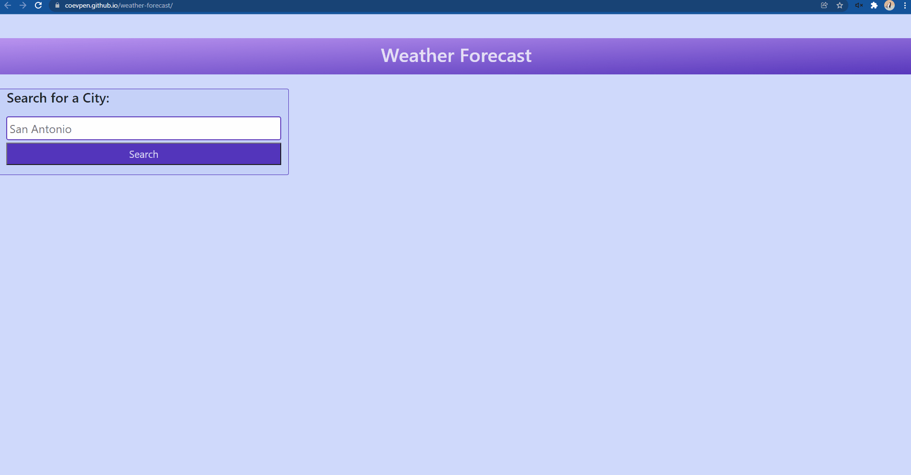

# Weather Forecast

## Purpose

I was provided the challenge to build a weather dashboard from scratch that utilizes a weather forecasting API. The user is to search for a city name and retrieves a 5-day forecast plus additional weather information upon clicking the search button. Buttons are dynamically created for cities previously searched so that the user can click on them to retrieve updated info without having to type in the city again. 

## Built With
* HTML
* CSS
* JavaScript
* Bootstrap
* OpenWeather API

## Website
https://coevpen.github.io/weather-forecast/

## Screenshot
